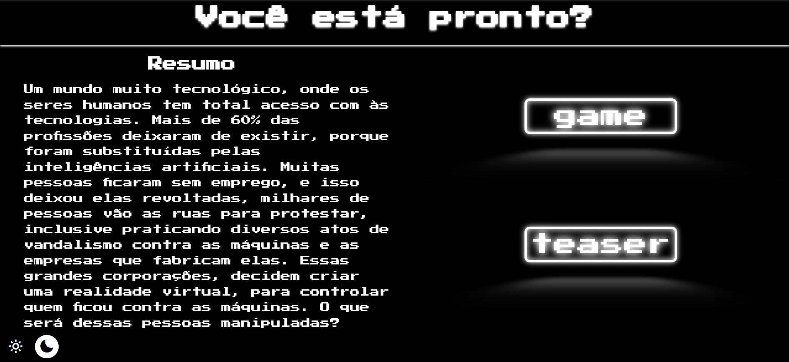
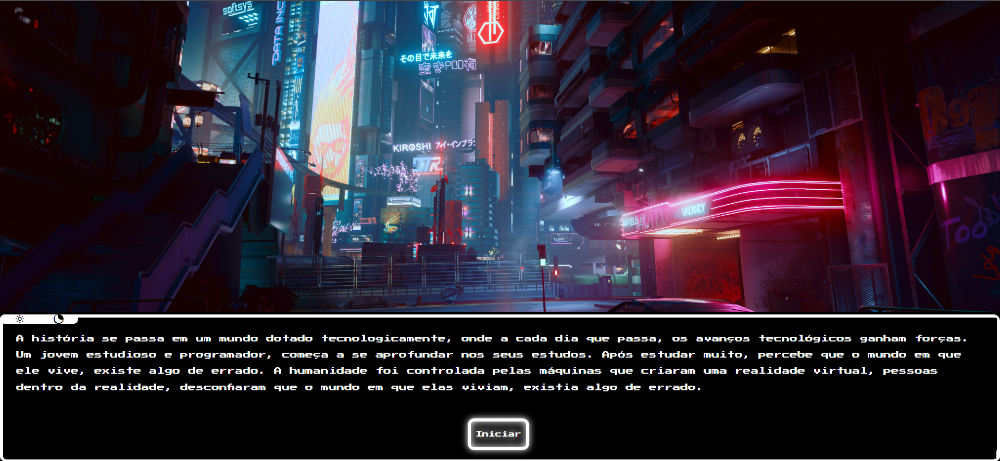

<h1 align='center'>CyberPunk 2022</h1>
<h2>Objetivo do projeto era desenvolver um livro jogo, onde o leitor poderá escolher quais decisões tomar.</h2>
 

 

 

<h2>🎞️ Link do teaser:</h2>
<h3>
    <a  href='https://youtu.be/9a3BoxnTelw'>Teaser Cyberpunk (2022)</a>
</h3> 

<h2>💻 Link do site:</h2>
<h3>
    <a  href='https://fabiolacosta.github.io/Cyberpunk-2022/'>Site Cyberpunk (2022)</a>
</h3> 

<h2>🚀 Tecnologias Utilizadas:</h2>

 
  
   
  

 
<h2> 📝 Desenvolvedores do Projeto:</h2>

| [ Fabiola Costa](https://github.com/fabiolacosta) |  [ Vitória Santos](https://github.com/vitoriacarolsa) |  [ Filipe Damasceno](https://github.com/Lipeh011) | [ Gustavo Goulart](https://github.com/goulartgusta) | [ Italo Sousa](https://github.com/Italo10s) | [ Kauã Melo](https://github.com/kauaMelo31) | [ Richard Alves](https://github.com/RichardSaaa) | [ Victor Perez](https://github.com/Victor2Perez) |
| :---: | :---: | :---: | :---: | :---: | :---: | :---: | :---: | 
